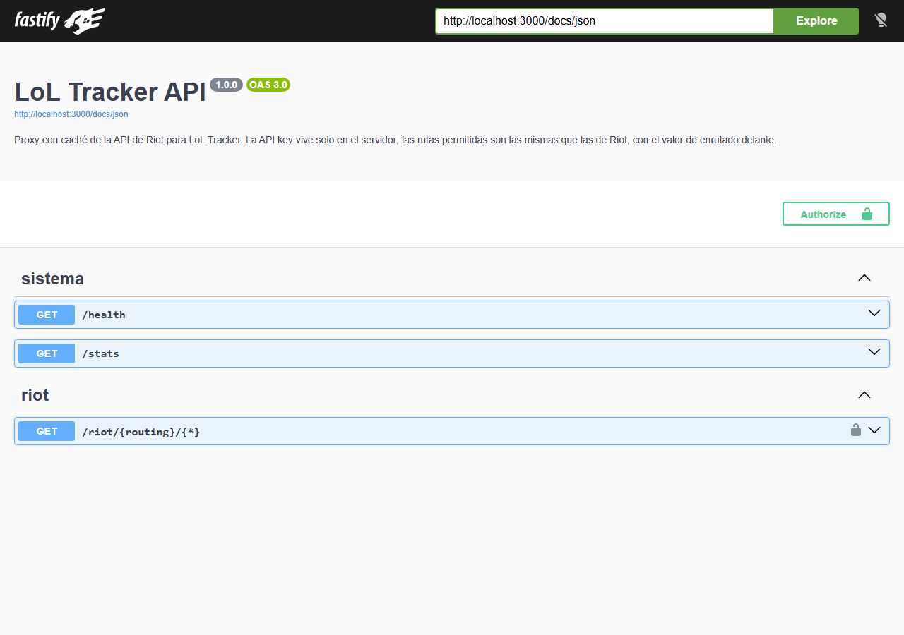

# LoL Tracker API · Node.js + Fastify + PostgreSQL

[](https://github.com/jimmyrom1/lol-tracker-api/actions/workflows/ci.yml)

Backend de [LoL Tracker](https://github.com/jimmyrom1/lol-tracker), la app Android para seguir tus
partidas de League of Legends. Resuelve lo que una app pública no puede hacer sola:

- **La API key de Riot vive solo en el servidor.** Cualquier cosa que vaya dentro de un APK se puede
  extraer. Con este backend el móvil no lleva ninguna key: el build ni siquiera la incluye.
- **Una caché compartida entre todos los usuarios, en PostgreSQL.** Una partida la juegan 10
  personas; con este servidor se descarga de Riot una sola vez, la abra quien la abra.
- **El límite de Riot se reparte entre todos.** El servidor controla la cuota de la key y, si se
  agota, responde `503 Retry-After` en lugar de dejar al usuario esperando.

La app solo tiene que cambiar la URL base: las rutas son **las mismas que las de Riot**, con el
valor de enrutado delante.

```text
Riot:     https://europe.api.riotgames.com/lol/match/v5/matches/EUW1_7995150714
Servidor: https://tu-servidor/riot/europe/lol/match/v5/matches/EUW1_7995150714
```



## Stack

| Capa | Tecnología |
| --- | --- |
| Servidor | Node.js 24 ejecutando TypeScript directamente (sin paso de build), Fastify 5 |
| Validación y docs | TypeBox + OpenAPI 3 generado (Swagger UI en `/docs`) |
| Datos | PostgreSQL 16 con `pg`, migraciones SQL con bloqueo *advisory* |
| Seguridad | Token de app opcional (comparación en tiempo constante), límite por cliente (`@fastify/rate-limit`), cabeceras sensibles fuera de los logs |
| Calidad | 29 tests con Vitest contra PostgreSQL real y un Riot simulado, `tsc --noEmit` estricto, oxlint |
| Infraestructura | Docker + Docker Compose, GitHub Actions con smoke test del stack completo |

## Arrancar

Con Docker:

```bash
RIOT_API_KEY=RGAPI-... docker compose up --build
```

Sin Docker, con Node 24 y un PostgreSQL:

```bash
cp .env.example .env      # pon tu DATABASE_URL y tu RIOT_API_KEY
npm install
npm run dev               # aplica las migraciones y arranca en http://localhost:3000
```

- Documentación interactiva: <http://localhost:3000/docs>
- Estado de la caché y de la cuota: <http://localhost:3000/stats>

### Conectar la app Android

En el `local.properties` de [lol-tracker](https://github.com/jimmyrom1/lol-tracker):

```properties
# 10.0.2.2 es el PC visto desde el emulador de Android
lolApi.url=http://10.0.2.2:3000
# Solo si el servidor tiene APP_TOKEN
lolApi.token=
```

Con `lolApi.url` definida, el build de la app **no incluye la key de Riot** aunque siga en
`local.properties`.

## Qué deja pasar y cuánto se cachea

No es un proxy abierto. [`routes.ts`](src/riot/routes.ts) define una lista blanca de rutas, con
sus parámetros validados. Todo lo demás se rechaza sin llegar a Riot ni gastar cuota.

| Ruta de Riot | Caché | "No existe" (404) |
| --- | --- | --- |
| Cuenta por Riot ID | 24 h | 5 min |
| Ids de partidas de un jugador | 1 min | 1 min |
| **Partida** y línea temporal | **para siempre** (una partida jugada no cambia) | 1 h |
| Invocador · Rango | 1 h · 10 min | 5 min · 10 min |
| Maestría (top · por campeón) | 1 h · 12 h | 1 h · 12 h |
| Partida en curso | 20 s | 20 s |

- La cabecera `X-Cache` dice si la respuesta vino de PostgreSQL (`HIT`), de Riot (`MISS`) o de
  una petición idéntica que ya estaba en curso (`SHARED`). `Age` indica su antigüedad.
- Los 404 también se cachean: si diez jugadores preguntan a la vez "¿estoy en partida?", Riot
  recibe una sola pregunta cada 20 segundos.
- Los errores (401, 403, 429, 5xx) no se cachean nunca.
- La clave de caché usa la query en forma canónica: `?start=0&count=20` y `?count=20&start=0` son
  la misma entrada.

## Decisiones técnicas

### Cada petición a Riot se aprovecha al máximo

La petición pasa por tres filtros antes de salir hacia Riot:

1. **Caché en PostgreSQL**, compartida por todas las instancias y usuarios.
2. **Peticiones en vuelo compartidas** ([`singleflight.ts`](src/singleflight.ts)): si llegan diez
   iguales mientras la primera está en camino, las diez esperan esa misma promesa. Un test lanza
   diez peticiones simultáneas por la misma partida y comprueba que Riot recibe una. La respuesta
   se guarda dentro del vuelo compartido, así que quien llega justo después ya la encuentra en
   caché.
3. **Limitador** ([`rateLimiter.ts`](src/riot/rateLimiter.ts)), con ventanas deslizantes por valor
   de enrutado (`europe`, `euw1`...), como las cuenta Riot:
   - Parte de 20/s y 100/2 min, y **adopta los límites que Riot manda en cada respuesta**
     (`X-App-Rate-Limit`). Con una key de producción aprovecha su cuota sin tocar código.
   - Usa el 90 % del límite: recibir 429 a menudo puede acabar con la key suspendida.
   - Si Riot aun así responde 429, ese host queda pausado para todos durante el `Retry-After`.
   - Si para enviar una petición habría que esperar más de 10 s, responde `503 Retry-After` en vez
     de colgar la conexión. Lo que ya está en caché se sigue sirviendo aunque no quede cuota.

Un test lanza 250 peticiones con un reloj falso y comprueba que ninguna ventana de 1 s ni de 2 min
se pasa. Con la key real, abrir las mismas 16 partidas desde un segundo móvil tardó 2,5 s y **no
hizo ni una petición a Riot**.

### La key no se filtra

- Solo [`riotClient.ts`](src/riot/riotClient.ts) la conoce. Si el cliente manda su propia
  `X-Riot-Token`, se ignora.
- Si Riot la rechaza (401/403), el cliente recibe `502 riot_key_rejected`, sin el detalle de Riot:
  es un problema del servidor que el usuario no puede arreglar.
- Las cabeceras `X-App-Token` y `X-Riot-Token` están en la lista `redact` del logger. Un test
  comprueba que la key no aparece ni en el cuerpo ni en las cabeceras de la respuesta.

### Rutas codificadas tal cual

Un Riot ID puede llevar espacios o eñes (`Peña Lol#ES1`). El servidor toma la ruta sin decodificar
de `request.raw.url` y la reenvía idéntica, para que no cambie la codificación por el camino. Tiene
su test.

### Migraciones sin herramientas externas

[`migrate.ts`](src/migrate.ts) aplica los `.sql` de `migrations/` en orden, cada uno en su
transacción. Antes toma un `pg_advisory_lock` para que dos contenedores arrancando a la vez no
apliquen la misma migración. La tabla tiene `CHECK` para que solo se guarden 200 y 404 y para que
una entrada no caduque antes de crearse. Hay un índice parcial sobre `expires_at` para la limpieza,
que borra lo caducado y nunca toca las partidas.

### TypeScript sin compilar

Node 24 ejecuta TypeScript quitando los tipos. El proyecto usa `erasableSyntaxOnly` (nada de
`enum` ni de *parameter properties*) e importa con extensión `.ts`. `tsc` solo comprueba tipos.
Así no hay `dist/` que se desincronice, y el contenedor ejecuta exactamente el código del
repositorio.

## Tests

```bash
npm test          # usa TEST_DATABASE_URL (en la CI, un servicio de PostgreSQL)
```

| Archivo | Qué cubre |
| --- | --- |
| `units.test.ts` | Lista blanca y validación de parámetros, limitador con reloj falso (ventanas, cabeceras de Riot, penalización tras 429, 503 si la espera es larga), peticiones en vuelo compartidas |
| `api.test.ts` | Contra PostgreSQL real y un Riot simulado: HIT/MISS/SHARED, caducidad por ruta, caché de 404, clave canónica, la key no sale del servidor, 429 → 503, cuota agotada, límite por cliente, token de la app, Riot ID codificado, `/stats`, migraciones idempotentes y limpieza |

La CI levanta además el `docker compose` completo con una key falsa y comprueba lo siguiente:

- Sin token de la app, la respuesta es 401.
- Una ruta fuera de la lista da 404.
- Riot rechaza la key y se devuelve `502` sin detalles.
- Las migraciones han creado la tabla de caché.

## Qué añadiría después

- Limitador compartido entre instancias (en PostgreSQL o Redis). Ahora cada instancia lleva su
  cuenta; con una sola instancia es exacto.
- Prioridades: que la partida en curso pase por delante de la sincronización en segundo plano.
- Métricas en formato Prometheus en lugar de `/stats`.

## Otros proyectos

Forma parte de una serie de proyectos con el mismo enfoque: reglas de negocio garantizadas
por la base de datos o por funciones puras, tests que prueban los casos difíciles y CI en cada push.

| Proyecto | Qué es |
| --- | --- |
| [LoL Tracker](https://github.com/jimmyrom1/lol-tracker) | App Android nativa que usa este backend: Kotlin, Jetpack Compose, Room, Hilt, detalle de partidas y asistente de draft. |
| [Subscriptions API](https://github.com/jimmyrom1/subscriptions-api) | API REST con Java 21 y Spring Boot 4: prorrateo, facturación idempotente, ShedLock, Flyway y Testcontainers. |
| [Reserva de salas](https://github.com/jimmyrom1/room-booking) | Flask + PostgreSQL + React: reservas sin solapes garantizadas por un `EXCLUDE` de PostgreSQL, JWT y exportación a calendario. |
| [Mini Facturas](https://github.com/jimmyrom1/mini-invoice-generator) | Flask + PostgreSQL + React: facturas con IVA por línea, IRPF, numeración correlativa atómica y PDF. |
| [Double-Entry Ledger](https://github.com/jimmyrom1/double-entry-ledger) | FastAPI + Asyncpg + PostgreSQL + React: motor contable con invariante de suma cero diferido, inmutabilidad y bloqueos pesimistas ordenados. |
| [Rate Limiter & Circuit Breaker gRPC](https://github.com/jimmyrom1/rate-limiter-grpc) | Go + gRPC + Protocol Buffers: control de tráfico (~90 ns/op) con Token Bucket, Sliding Window, Leaky Bucket y Circuit Breaker. |
| [Live Auction Engine](https://github.com/jimmyrom1/live-auction-engine) | Node.js 24 + WebSockets + SQLite WAL + React 19: subastas en tiempo real con resolución atómica de carreras concurrentes y anti-sniping. |


## Licencia

MIT. League of Legends es una marca de Riot Games. Este proyecto no está respaldado por Riot y solo
usa sus APIs públicas.
